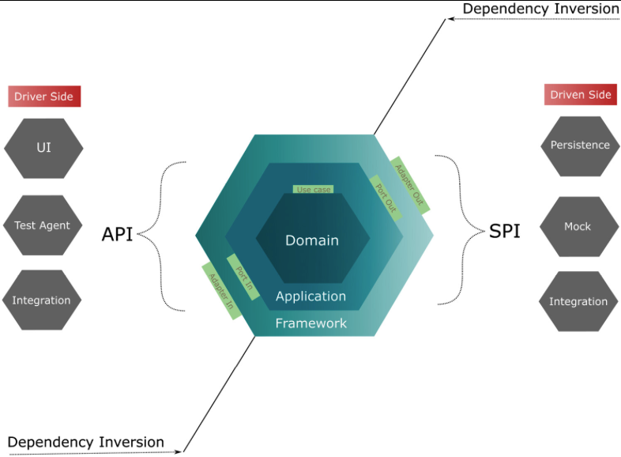

# Designing Hexagonal Architecture with Kotlin

---

<a href="https://www.packtpub.com/product/designing-hexagonal-architecture-with-java-and-quarkus/9781801816489?utm_source=github&utm_medium=repository&utm_campaign=9781801816489"></a>


A Kotlin version of the project presented by the book:
"[Designing Hexagonal Architecture with Java](https://github.com/PacktPublishing/Designing-Hexagonal-Architecture-with-Java)"

This repository follows the chapters of the book, and applying the changes using
Kotlin as the choosen language, and applying Kotlin idiomatic features to the
design.

<br><br>

---

## Instructions & Navigations

This repository follows (of course) the hexagonal architecture, described in the
following diagram:



The code in the repository structured into three gradle modules:

- [Domain](./domain/README.md)
- [Application](./application/README.md)
- [Framework](./framework/README.md)


## Build Requirements

- JVM 21 or above
- Gradle 8 or above
- Kotlin 1.9 or above

## Run Locally

To build to project locally simply run the following Gradle command:

```shell
$ ./gradlew build
```

---

This repository was build as part of the book reading club at [Billio](https://www.billie.io/).
