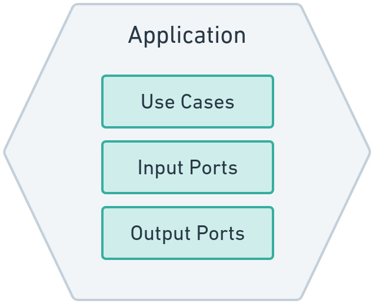
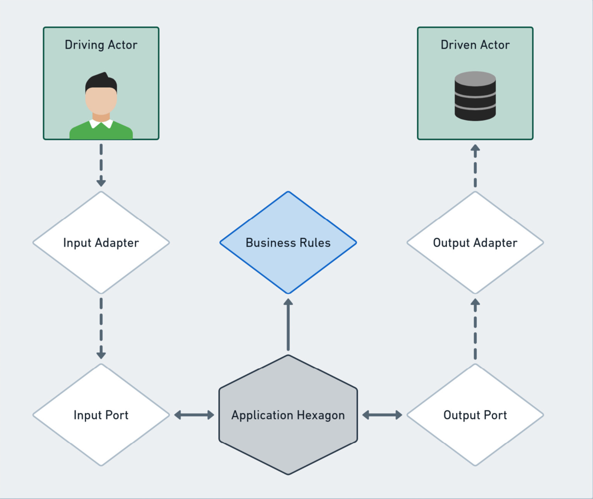

# Application Hexagon

The application hexagon is responsible to orchestrate the business flow
leveraging the power of the domain logic.

The application hexagon defines the contract it will expose to the outside world
(in our case the `framework` hexagon) using the `Use Cases`, which are
interfaces. Each use case is implemented as a `Input Port`, that defines the orchestration
required for this specific case. Lastly, the application hexagon defines the
data it wants to persist using the `Output Ports`. Those are interfaces, that
will be implemented on the framework hexagon, and can point to many different
alternatives (e.g., File, Db, Cache)

The entire flow of this hexagon can be seen as:

