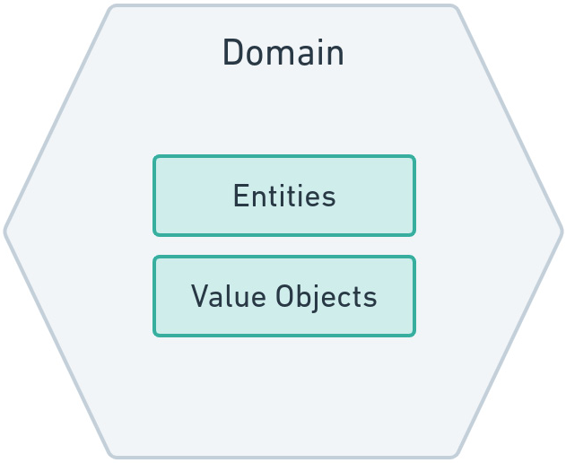
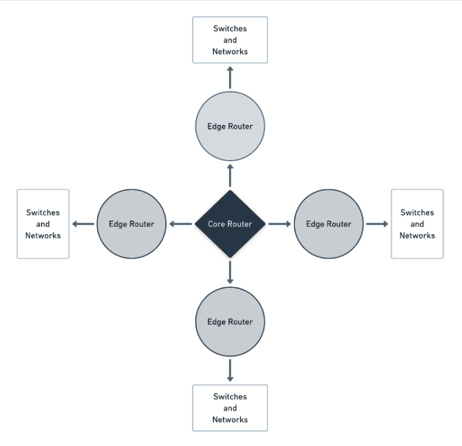
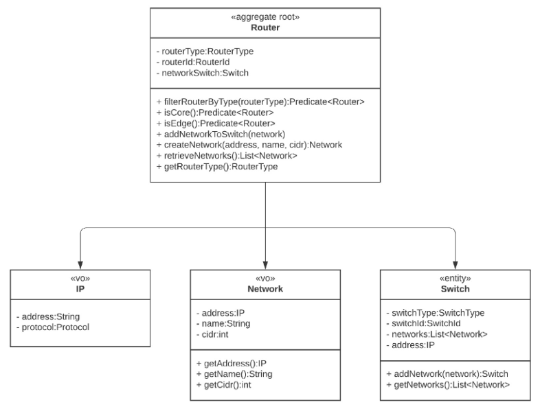

# Domain Hexagon

The domain module contains the following:

- **Entities** - A representation of the business logic entities that lives
  within the domain.
- **Value Objects** - elements within the domain that do not require unique
  identification per instance (e.g. IP, Network, RouterType)
- **Domain Services** - services of operations that are should not live directly
  within the domain entities, e.g. EventSearch, RouterSearch.
- **Specification** - business rules that allowing us to enforce and combine the
  rules of our business in a flexible way.
- **Policies** - allowing to apply different policy (strategy) based on the
  configuration applied, e.g. parsing events using Regex vs split the strings.

In this specific project, the domain looks as follows:

We're leveraging the power of aggregate (DDD) in this project, with the
following class diagram:

